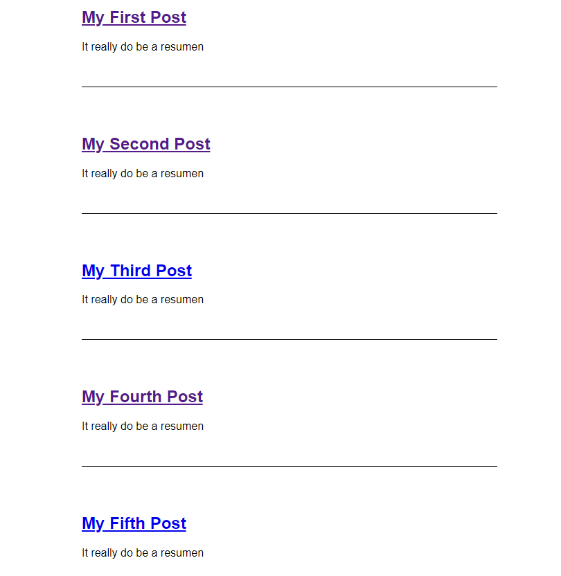
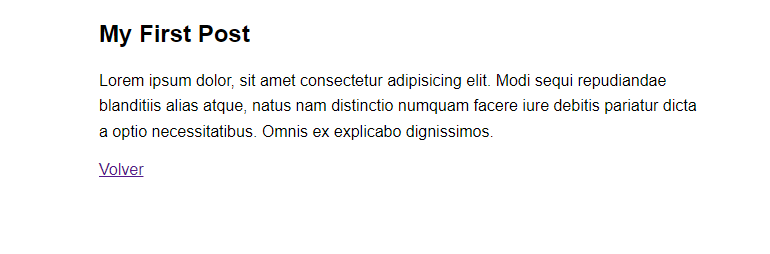

# Exercicio Laravel Base de Datos

## Desarrollo

Feito seguindo o tutorial de Laracast: Laravel from scratch: https://laracasts.com/series/laravel-8-from-scratch

## Primeira parte

A primeira parte consiste na creación das rutas para que os posts que facemos en html enlacen uns con outros no entorno do Laravel. A tal efecto usamos un paquete de composer chamado Yaml Front Matter que instalamos desde a consola. agrupamos os posts nunha colección de Laravel e nos aseguramos de cachealos para que non teñan que cargar cada vez que accedemos á páxina.

```php
return collect(File::files(resource_path("posts")))
->map(fn($file) => YamlFrontMatter::parseFile($file))
->map(fn($document) => new Post(
    $document->title,
    $document->excerpt,
    $document-date,
    $document-body(),
    $document->slug
))
```

A colección inclue o título, a data e os elementos por separado para así poder chamalos individualmente e amosalos por exemplo na preview do post da páxina principal:



O post individual veríase así.



## Configurar as blades

O seguinte paso foi deixar unhas blades funcionales para dirixir correctamente os contidos a cada un dos posts. Para iso configuramos post.blades.php así:

```php
@extends('layout')

@section('content')

<article>
            <h1>
                    {{ $post->title }}
            </h1>
        
            <div>
                    {!! $post->body !!}
            </div>
        </article>
<a href="/">Volver</a>
@endsection
```

Así cada post amosa un contido, título e corpo personalizado, e o resto das seccións se imprime a partir de ahí.


## Migrar as bases de datos

O seguinte paso foi conectar coa base de datos e recheala de táboas. Para isto, miramos as tablas dun proxecto a outro e logo as modificamos no VSC para meterlles contido, recordando poñer na terminal  php artisan migrate:fresh para ter sempre os datos actualizados.

O paso 25 é o último paso que fixemos e polo tanto tamén é donde o meu traballo se remata.
